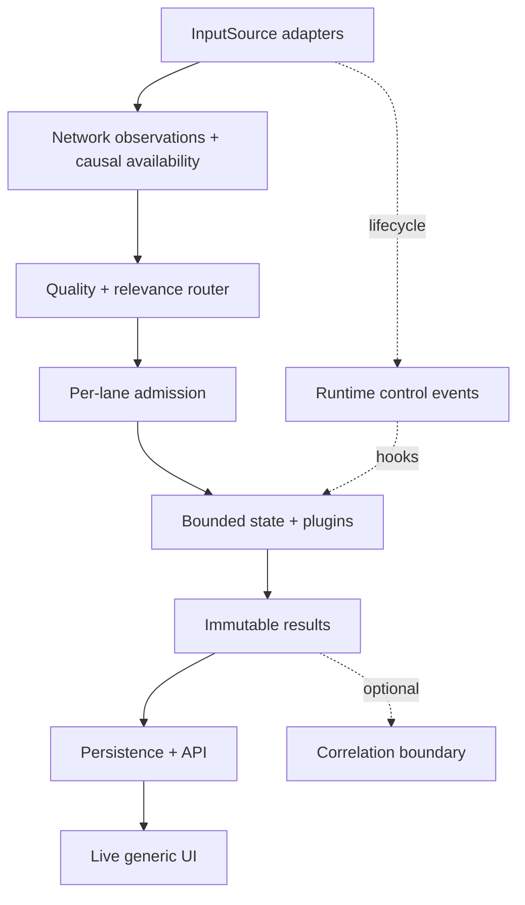

# SIH26145 — MVP SYSTEM RESEARCH HANDOFF v1.2

**Scope:** shared product/runtime infrastructure only  
**Status:** `CONTROL ROOM APPROVED — IMPLEMENTATION-AUTHORITATIVE`  
**Research access date:** 2026-09-13  
**Authority:** official SIH26145 problem statement first; supplied threat cards are prior work and constrain, but do not authorize, threat analytics.

**Revision note:** v1.2 retains the v1.1 architecture and applies the final minor contract decisions `DEC-SYS-23` through `DEC-SYS-26`. It supersedes v1.1 as the implementation-authoritative handoff while preserving prior revisions in version history.

### Applied Control Room corrections

| Correction | Applied in |
|---|---|
| Three-level taxonomy | §§1.1, 6.1, 9.2, 16 |
| Causal availability/finality | §§2.5, 3, 4.1, 12, 16 |
| Relevance routing vs analytic admission | §§3, 5, 6.1–6.2, 12, 16 |
| Scientific history vs runtime TTL | §§2.5, 6.1, 7.3, 16 |
| Conditional watermarks | §§2.5, 6.2, 11–12, 16 |
| Gap-aware live overload | §§6.1, 7.3, 8, 16 |
| Governance-owned scientific status | §§3.1, 6, 8.3, 9.2, 11, 16 |
| Restricted QUIC v1 boundary | §4.2 and `DEC-SYS-21` |
| Corrected performance timing | §12 |
| Stable/versioned source ledger | §§13 and 15 |
| PS examples vs product alert minimum | §§1.1, 9.2, 16 |
| Separate network/control typed unions | §§3, 4.1, 4.3, 16 |
| Machine-readable scientific status | §§6, 9.2, 16 |
| One canonical unavailable result type | §§0, 6.4, 9, 16 |

---

## 0. Executive decision

[PROPOSAL] Build the MVP as a **single-node, modular streaming application** with:

1. pluggable `InputSource` adapters;
2. immutable, typed network observations and separate runtime control events;
3. explicit causal availability, finality, quality, and observation-contract facts;
4. a compiled **zero-to-many relevance router** followed by a distinct per-lane analytic-admission check;
5. one bounded, independently observable mailbox per plugin lane, optionally split into deterministic entity-affine shards, with declared gap handling;
6. replaceable scaffold, transparent, or ML analytic implementations behind one plugin contract;
7. immutable result records plus optional later correlation records;
8. a single persistence writer to SQLite in WAL mode for the MVP;
9. a generic REST API and WebSocket live feed; and
10. first-class performance and data-loss instrumentation.

[REJECTED] Do not begin with Kafka, Flink, Akka, Kubernetes, Redis, Elasticsearch, a microservice per plugin, a blockchain, or a central attack-classification model. Each adds operating and failure modes that the current single-node prototype has not shown it needs.

[KEEP OPEN] The exact PCAP decoder, queue capacities, number of worker shards, sustained traffic target, storage retention, and process isolation must be selected from measurements and the approved input contract—not guessed here.

The governing distinction is:

> The router selects **relevant analytics**. It does not decide which attack occurred.

The runtime may deliver one observation to zero, one, or several plugins. A scientifically unfinished lane can still be represented by a scaffold that validates observation, routing, lifecycle, quality, and performance, but it emits `AnalyticUnavailable` with a precise reason rather than a fabricated threat verdict.

---

## 1. Governing constraints

### 1.1 Official PS constraints

**[PS]** The official statement requires passive/read-only input, no active handshake completion, no action back across the ingest path, no TLS/QUIC payload decryption, incremental streaming with bounded alert latency, and a declared and demonstrated throughput target. It requires standardized structured alerts and identifies timestamp, flow identifier, threat class, confidence score, and supporting evidence as representative fields. It permits PCAP, NetFlow/IPFIX/sFlow, and derived metadata. [PS] [SYS-CLM-001]

**[DECISION]** EvidenceGate adopts those representative fields as the minimum shared `ThreatAlert` contract.

The official PS threat taxonomy contains **six categories**:

1. volumetric/protocol DDoS;
2. botnet C2 beaconing;
3. DGA domains and DNS tunnelling;
4. malware inside encrypted sessions;
5. reconnaissance and port scanning;
6. data exfiltration.

The runtime preserves three distinct taxonomy levels:

| Level | Meaning | Examples |
|---|---|---|
| `official_ps_category` | Exact six-category PS taxonomy | `DGA_DOMAINS_AND_DNS_TUNNELLING` |
| `analytic_family` | Seven EvidenceGate product families | `DGA`, `DNS_TUNNELLING` |
| `analytic_lane` | Further scientific subdivision | `DGA_A`, `DGA_B`, `TLS_TCP`, `QUIC` |

The seven EvidenceGate families are `DDOS`, `C2`, `DGA`, `DNS_TUNNELLING`, `ENCRYPTED_SESSION`, `RECON`, and `UNUSUAL_TRANSFER`. Seven EvidenceGate families do not imply seven PS categories, and one PS category does not imply one analytic. TLS-over-TCP and QUIC are explicit lanes under `ENCRYPTED_SESSION`; they must not be flattened into one protocol. [DEC-SYS-15]

### 1.2 Constraints inherited from supplied threat cards

The cards collectively establish that observation type, direction, capture quality, and history determine which facts are available. Generic flow records cannot be treated as packet order, DNS QNAMEs, TLS records, or reverse evidence. Missing reverse traffic is not proof of no response. Encrypted DNS does not expose clear QNAME semantics. Theft, malware, authorization, intent, victim impact, and endpoint process truth are not generally inferable from network facts alone. [PRIOR WORK] [SYS-CLM-002]

Therefore the shared runtime must:

- preserve the declared observation contract (`OC-A` through `OC-E` or a later validated contract);
- preserve named wire direction without silently translating it to business meaning such as inbound/outbound;
- distinguish current-event, window/history-required, reverse-evidence-required, and flow-end-only facts;
- propagate loss, sampling, parser failure, clock quality, and missing fields;
- allow analytic abstention/unavailability as a normal result;
- never synthesize absent fields or confidence; and
- keep original results immutable when later evidence or correlation is added.

---

## 2. Research synthesis: mature patterns and what we reuse

### 2.1 Policy-neutral observation layer

Zeek separates a packet-processing event engine from policy interpretation. Its event engine reduces packets into higher-level, policy-neutral events—facts about what was observed—while scripts add meaning and maintain state across time. Zeek's packet pipeline begins with an input source, parses lower layers, constructs sessions, and continues to application analyzers; its analyzers are extensible. [SOURCE] [SYS-CLM-003] [SYS-CLM-004]

**Implication for EvidenceGate:** canonical observations should be factual and analytic-neutral. Threat plugins—not the parser or router—own interpretations, thresholds, learned models, and claim ceilings.

### 2.2 Typed protocol outputs rather than a mega-schema

Suricata EVE emits JSON records for alerts, anomalies, metadata, files, flows, and protocol-specific events such as DNS, TLS, and QUIC. Zeek similarly keeps connection and DNS facts in typed logs connected by identifiers. [SOURCE] [SYS-CLM-005] [SYS-CLM-006]

**Implication:** use an envelope plus typed payloads. Do not create one mostly-null object containing every packet, flow, DNS, TLS, and QUIC field.

### 2.3 Entity-affine execution and per-key ordering

Suricata's worker model uses multiple threads and assigns packets using a 5–7-tuple hash; packets for related flows therefore reach the appropriate processing context. Its worker threads contain the full packet pipeline, while its `autofp` arrangement separates capture/decode from flow workers. [SOURCE] [SYS-CLM-007]

Akka demonstrates the more general actor rule: an actor instance processes one message at a time, so its state does not require concurrent mutation guards. Akka itself is not chosen: it introduces a JVM/Scala-or-Java stack and its current library documentation lists BUSL-1.1 licensing. [SOURCE] [SYS-CLM-008]

**Implication:** adopt the pattern, not the framework. Within each plugin lane, map a stable `state_key` to one shard. A shard consumes a FIFO mailbox serially; different shards and different lanes run concurrently.

### 2.4 Bounded queues and backpressure

Python's `asyncio.Queue(maxsize>0)` blocks an awaited producer when full and exposes exact queue depth; `put_nowait` reports `QueueFull`. [SOURCE] [SYS-CLM-009] Flink defines backpressure as a downstream task consuming more slowly than an upstream task produces, and exposes busy, idle, and backpressured time. [SOURCE] [SYS-CLM-010]

**Implication:** every asynchronous boundary is bounded and measured. However, one universal overflow rule is wrong:

- **replay / strict validation mode:** pause source progress to preserve observations, and make the slow lane visible;
- **live / non-pausable mode:** a full lane may drop only for that lane, increment a lane-local loss interval, degrade quality, and continue routing to unaffected lanes;
- **UI delivery:** never backpressure analytics because a browser is slow; persist first, then use a bounded client feed that can coalesce refresh notifications;
- **persistence saturation:** pause result production if lossless result storage is required; never silently drop an emitted analytic result.

### 2.5 Causal time, conditional watermarks, and finite history

Flink distinguishes processing time from event time. Event-time processing may use watermarks to express progress and an explicit lateness trade-off; windows bound otherwise infinite stream aggregates. Flink also provides keyed-state TTL, whose current semantics are processing-time based and therefore do not substitute for an analytic's scientific event-time history. [SOURCE] [SYS-CLM-011] [SYS-CLM-012]

**Implication:** keep `event_time`, `causal_available_time`, `ingest_time`, and monotonic processing clocks separate. Event-time support is required. An explicit lateness policy is required when disorder matters. Watermarks are conditional: an ordered single-PCAP replay may need only packet order, timestamps, and end-of-source, while asynchronous sources, late exports, bounded-lateness window closure, or multi-source joins may require watermarks. Scientific history horizon and runtime idle TTL are separate declarations. [DEC-SYS-06] [DEC-SYS-16] [DEC-SYS-18]

### 2.6 Live delivery, persistence, and instrumentation

FastAPI supports WebSocket endpoints that send/receive JSON and handle multiple clients/disconnections. [SOURCE] [SYS-CLM-013] SQLite WAL allows readers and a writer to proceed concurrently on one host, but still permits only one writer at a time and requires checkpoint management. [SOURCE] [SYS-CLM-014]

Prometheus guidance recommends stage-level input/in-progress/output counts, last-processed timestamps or heartbeats, queue/thread-pool metrics, errors, and latency; it warns against unbounded/high-cardinality labels. [SOURCE] [SYS-CLM-015]

**Implication:** use a single SQLite writer for MVP results and metadata; expose REST for durable queries and WebSocket for low-latency notification. Metrics use bounded labels such as plugin ID, observation type, source ID class, and outcome—not flow IDs, IPs, domains, or entity keys.

---

## 3. Proposed architecture



### 3.1 Component boundaries

| Component | Owns | Must not own |
|---|---|---|
| `InputSource` | PCAP/live/flow/NDJSON acquisition; source offsets; source lifecycle; raw source metadata | Threat labels, feature thresholds, routing to attacks |
| Canonicalizer | Parse-once factual normalization; typed **network** observations; provenance; field-presence; direction basis | Malicious/benign interpretation; filling missing facts |
| Runtime control plane | Typed source/quality/watermark/health/status events and lifecycle hooks | Normal threat relevance routing or analytic facts |
| Quality/Visibility | Capture/parser/sampling/loss/clock/OC facts and quality intervals | Treating low quality as benign; analytic thresholds |
| Relevance router | Type index, versioned relevance predicates, zero-to-many fan-out | Scientific usability/admission, attack classification, confidence, shared threat score |
| Lane admission | Required fields, OC, quality, finality, history, and governed analytic availability; typed rejection reasons | Converting absence into a benign result; mutating analytic state |
| Lane runtime | Bounded mailboxes; deterministic shards; lifecycle; timeouts; gap actions; error isolation; metrics | Scientific state definition not declared by plugin |
| Threat plugin | State key/history; accepted factual state; analytic logic; result/evidence construction; capability reporting | Parser internals, shared persistence, UI formatting, self-promotion of scientific status |
| Result sink | Validate and persist immutable records; publish stored IDs | Re-score or reinterpret evidence |
| Correlator | Later derived links/results with explicit version and provenance | Mutation or deletion of original results |
| API/UI | Generic query/live views; evidence drill-down; health/performance | Hidden scientific logic or threat-specific product assumptions |

### 3.2 Runtime topology

[PROPOSAL] Start as one deployable application with logical modules and supervised asynchronous tasks. Logical boundaries must be real interfaces even if they share a process. This minimizes serialization, deployment, and distributed-failure costs while retaining a migration path.

Recommended task groups:

- one source task per active `InputSource`;
- synchronous or bounded canonicalization immediately after source read;
- one fast relevance-router task;
- one admission check at each matched lane before state mutation;
- one or more FIFO worker shards per plugin lane;
- one result validation/persistence writer;
- one live-notification hub;
- one periodic metrics/health sampler.

[KEEP OPEN] Move a CPU-heavy plugin to a process pool or dedicated subprocess only when profiling shows it blocks the event loop or consumes an unacceptable share of latency. A plugin process boundary must preserve the same observation and result contracts.

---

## 4. Canonical observation model

### 4.1 Separate typed event families

`CanonicalEvent` has two disjoint typed unions:

```text
CanonicalEvent
├── NetworkObservation
│   ├── PACKET
│   ├── FLOW
│   ├── DNS
│   ├── TLS
│   └── QUIC
└── RuntimeControlEvent
    ├── source lifecycle
    ├── quality / parser events
    ├── watermark events
    └── health / status events
```

Every immutable `NetworkObservationEnvelope` has:

| Field | Meaning |
|---|---|
| `observation_id` | Unique runtime record ID; not a threat ID |
| `schema_version` | Canonical schema version |
| `observation_type` | Exactly one network factual type: `PACKET`, `FLOW`, `DNS`, `TLS`, or `QUIC` |
| `event_time` | When the underlying network event occurred |
| `causal_available_time` | Earliest event-time point at which the complete fact could legitimately be known |
| `ingest_time` | Time accepted by EvidenceGate |
| `source_id` | Stable sensor/replay/export source identifier |
| `source_kind` | PCAP, live capture, NetFlow/IPFIX/sFlow, Zeek JSON, Suricata EVE, or admitted derived feed |
| `source_position` | Packet index, byte offset, exporter sequence, or record index when available |
| `observation_contract` | Declared OC and direction projection; never inferred silently |
| `wire_direction` | Named observed wire direction; may be `UNKNOWN` |
| `direction_basis` | Vantage/projection basis supporting `wire_direction` |
| `finality` | Current, intermediate, terminal, or unknown completeness status |
| `availability_basis` | Immediate, window-derived, reverse-dependent, flow-end-only, or other versioned basis |
| `provenance_ref` | Source manifest, raw file hash/reference, parser and configuration versions |
| `quality_ref` | Quality snapshot/interval applying to the record |
| `present_fields` | Machine-checkable factual field presence |
| `payload` | Exactly one typed payload |

`processing_started_monotonic` and other internal clocks are tracing data, not network facts.

For an immediately parsed packet, `event_time` and `causal_available_time` are normally equal. For a terminal flow record whose `event_time` is the flow start, `causal_available_time` is the export/final time. For a statistic requiring the twentieth observation, it cannot precede the twentieth observation. Every derived-feed adapter must document what each record describes, when the underlying event occurred, when the fact could first have been emitted, and whether it is current, window-derived, reverse-dependent, or flow-end-only. An embedded log timestamp alone does not prove causal availability. [DEC-SYS-16] [DEC-SYS-20]

### 4.2 Typed payloads

#### `PacketObservation`

Minimum common facts: captured/wire length, L2 type where present, IP version, source/destination address, transport protocol, source/destination port where applicable, TCP flags/sequence/acknowledgement when observed, fragmentation facts, and raw reference—not copied payload by default.

Use for packet-prefix, flag, rate, or ordering analytics. Packet payload must not be placed in general results. Protocol extractors may consume packet bytes once and emit typed higher-level facts.

#### `FlowObservation`

Minimum facts: flow ID basis, endpoints, protocol, start time, end/export time, directional counters exactly as supplied, terminal/intermediate marker, exporter timeout/active-timeout semantics, sampling configuration, and end reason/state only if documented.

Do not call a terminal flow timestamp the time the behavior first became detectable. Do not infer TCP packet order or DNS/TLS fields from generic flows.

#### `DNSObservation`

Minimum facts: message event time, flow reference, observed message direction, QR/request-or-response flag when decoded, transaction ID, QNAME, QTYPE/QCLASS, RCODE/answers only when present, transport, truncation, and clear-DNS visibility. Preserve raw and normalized name forms separately and record normalization version.

Do not infer an unseen query from a response containing a name. Query-response pairing is separate factual correlation with explicit completeness/timeout.

#### `TLSObservation`

Minimum facts: flow/session reference, observed direction, TCP reassembly status, parser/version, handshake message metadata actually visible, TLS version/record metadata when validly parsed, packet/record index, elapsed prefix time, and missing-byte/gap indicators.

`TLSObservation` never contains decrypted application content. A packet-size sequence is not represented as a TLS-record sequence unless reassembly and TLS parsing justify it.

#### `QUICObservation`

Minimum v1 shell: flow/session reference, observed direction, QUIC version, long/short-header classification, packet/header type, packet length, visible connection IDs, parser/version, packet index, timing, and visibility capability flags—only where each field is demonstrably available without prohibited payload decryption.

QUIC is not a TLS-over-TCP record. TLS and QUIC typed payloads may share envelope fields, not protocol assumptions. QUIC Initial or richer handshake processing is not silently admitted; each richer field requires an explicit observability decision under the PS passive/no-decryption boundary. QUIC parser semantics remain open while the canonical shell may be built. [DEC-SYS-21]

### 4.3 Runtime control-event envelope

`RuntimeControlEvent` has its own immutable envelope containing `control_event_id`, `schema_version`, `control_type`, `event_time` where meaningful, `ingest_time`, `source_id`/`lane_id` as applicable, provenance, quality reference, and typed control payload. It is never represented by `NetworkObservationEnvelope.observation_type`.

Its control types include:

- `SourceStarted`, `SourcePaused`, `SourceEnded`, `SourceFailed`;
- `WatermarkAdvanced`;
- `QualityGapOpened`, `QualityGapClosed`;
- `ParserErrorObserved`;
- `LaneHealthChanged`;
- `ScientificStatusImported`, `IntegrationStatusChanged`, and `OperationalHealthChanged`.

Threat relevance routing consumes `NetworkObservation` only. Control events are persisted and shown in the UI, while a plugin receives a quality or control event only through a declared lifecycle hook such as `on_quality_gap`, `on_watermark`, or `on_expire`; no control event can accidentally match the normal observation router. [DEC-SYS-24]

### 4.4 Provenance and quality

`SourceManifest` should record source URI/reference, SHA-256 where a finite artifact exists, byte size, capture/export tool and version, start/end event time, declared OC, interface/vantage description, snap length, filter, sampling, clock/time zone, parser configuration/version, ingest run ID, and known gaps.

`QualitySnapshot` should record at least:

- capture/source drops and basis of measurement;
- application/router/lane drops;
- packet truncation/snap length;
- sampling rate and algorithm when known;
- parser failures/unsupported protocol counts;
- event-time ordering/lateness;
- clock quality/skew when known;
- direction confidence/basis;
- visibility flags such as clear DNS, reverse path, packet order, and flow-finality.

[PROPOSAL] Quality is compositional: `source quality + parser quality + runtime delivery quality + analytic prerequisites`. A plugin result references the applicable quality facts and lists unmet requirements. There is no single magic quality score in v1.

---

## 5. Zero-to-many router

### 5.1 Routing algorithm

At plugin registration, compile a table:

`observation_type -> candidate plugin manifests`

For each observation:

1. look up candidate plugins by exact accepted type;
2. execute each candidate's bounded, side-effect-free relevance predicate;
3. enqueue the same immutable observation reference to every relevant lane/shard;
4. at that lane, run an admission check before state mutation or analytic processing;
5. admit the observation or preserve one or more typed reasons: `PREREQUISITE_MISSING`, `UNSUPPORTED_OBSERVATION_CONTRACT`, `INSUFFICIENT_VISIBILITY`, or `ANALYTIC_UNAVAILABLE`;
6. record candidate, relevant, delivered, admitted, rejected-by-reason, predicate, and admission timing.

Complexity is proportional to the number of plugins accepting that type, not the total threat catalogue. With seven internal lanes this is already small; readability and traceability matter more than exotic indexing.

### 5.2 Router invariants

- Routing is zero-to-many.
- Predicates answer only “could this plugin use this fact?”
- Predicates do not mutate state, perform I/O, calculate threat confidence, or emit alerts.
- Required fields, OC, finality, visibility, quality, history readiness, and governed scientific availability belong to admission, not relevance routing.
- Admission failure remains an explicit typed record/diagnostic and is never a benign classification or an invisible router miss.
- A router exception isolates/disables that plugin registration and raises lane health; it does not reinterpret the observation.
- Router version and plugin manifest version are recorded in results/diagnostics.

This separation preserves both questions: the router answers “who may care?” and lane admission answers “can this lane legally and scientifically use the evidence now?” [DEC-SYS-17]

### 5.3 Example without threat invention

`TLSObservation -> EncryptedSessionScaffold` is valid when type/field boundaries are approved. The scaffold may confirm routing and session-fact continuity, then emit/maintain `AnalyticUnavailable(reason_code=SCIENTIFIC_NOT_READY)`. It may not invent a packet-shape feature, threshold, malicious label, or confidence.

---

## 6. Plugin contract and governed status

### 6.1 Required manifest

Each plugin supplies a versioned, serializable manifest:

| Field | Contract |
|---|---|
| `plugin_id` | Stable unique ID; separate from public threat family |
| `plugin_version` | Semantic/code version used in every result |
| `official_ps_category` | One of the six exact official PS categories |
| `analytic_family` | One of the seven EvidenceGate product families |
| `analytic_lane` | Explicit internal lane/sub-lane |
| `scientific_status_ref` | Read-only reference to governance-owned, machine-readable status/phase/blockers configuration |
| `integration_status` | Runtime/integration capability state |
| `accepted_observation_types` | Typed list |
| `routing_predicate_id/version` | Versioned relevance predicate |
| `admission_spec` | Required fields, OC, visibility, reverse/finality/history and scientific-availability conditions |
| `quality_requirements` | Required loss/sampling/parser/clock conditions |
| `state_owner` | Plugin; runtime supplies storage/lifecycle primitives |
| `state_key_spec` | Exact factual key and normalization version |
| `scientific_history_spec` | Causally preceding event-time horizon, warm-up, and lateness policy |
| `resource_retention_spec` | Idle TTL, max keys, max events/bytes per key, eviction behavior |
| `on_gap` | `CONTINUE_WITH_QUALITY_FLAG`, `RESET_AFFECTED_STATE`, `REENTER_WARMUP`, `ABSTAIN_UNTIL_RECOVERED`, or `DISABLE_LANE` |
| `result_types` | Explicit result variants the plugin may emit |
| `confidence_semantics` | Absent unless an approved analytic defines it |
| `severity_semantics` | Versioned mapping or `NOT_APPLICABLE` |
| `health_policy` | Error threshold, timeout, restart/disable behavior |
| `profile_hooks` | Counters/timers/state estimators required by runtime |
| `claim_ids/decision_ids` | Governing scientific authority |

### 6.2 Processing interface

Conceptual interface only; not an implementation contract:

```text
manifest() -> PluginManifest
route(observation) -> bool
admit(observation, quality, governed_status, state_status) -> AdmissionDecision
state_key(observation) -> StateKey | None
process(observation, context, state) -> list[ResultDraft]
on_watermark(watermark, context, state) -> list[ResultDraft]  # only when declared
on_quality_gap(gap, context, state) -> list[ResultDraft]
on_expire(key, context, state) -> list[ResultDraft]
health() -> PluginHealth
```

The runtime validates drafts before persistence. `integration_status=RUNTIME_SCAFFOLD_READY` and the governance-owned scientific status limit allowed result types regardless of what plugin code attempts to return.

### 6.3 Independent status axes

The runtime exposes three independent axes:

| Axis | Owner | Examples |
|---|---|---|
| `scientific_status` | Decision Board / Control Room configuration | `ANALYTIC_UNAVAILABLE`, `EVIDENCE_CONSTRUCTION`, `BASELINE_UNDER_VALIDATION`, `ANALYTIC_VALIDATING`, `MODEL_VALIDATED` |
| `integration_status` | Runtime release/configuration | `RESEARCHING`, `OBSERVATION_CONTRACT_READY`, `RUNTIME_SCAFFOLD_READY`, `BASELINE_IMPLEMENTED`, `DEMO_READY` |
| `operational_health` | Runtime measurements | `HEALTHY`, `BACKPRESSURED`, `STALLED`, `FAILED`, `DISABLED` |

A lane may therefore be `ANALYTIC_UNAVAILABLE` + `RUNTIME_SCAFFOLD_READY` + `HEALTHY`. `DEMO_READY` never implies scientific validation. Plugin code may report capabilities and health facts, but it cannot promote its own `scientific_status`; the runtime imports it from versioned governance configuration. `scientific_phase` and `scientific_blockers` explain the status without becoming slash-combined enums. [DEC-SYS-19] [DEC-SYS-25]

### 6.4 Scaffold restrictions enforced by runtime

At `RUNTIME_SCAFFOLD_READY`, allowed outputs are limited to:

- `AnalyticUnavailable` with a reason such as `SCIENTIFIC_NOT_READY`;
- `PrerequisiteMissing`;
- factual state/coverage diagnostics approved by the manifest;
- `QualityDegraded`;
- `PluginStatus`, health, and performance.

The result validator rejects alert, malicious/benign verdict, severity, confidence, or threat score fields from a scaffold.

Current scientific-status values must be imported from the Control Room/Decision Board. This document does not promote any lane.

### 6.5 Governed scientific state imported at this gate

The governance configuration is normalized as:

```text
scientific_status:  machine-readable analytic state
scientific_phase:   current research/data/semantic phase
scientific_blockers: zero-to-many machine-readable blockers
```

| Analytic lane | `scientific_status` | `scientific_phase` | `scientific_blockers` |
|---|---|---|---|
| `DDOS` | `ANALYTIC_UNAVAILABLE` | `RESEARCH_TARGET_ONLY` | `[]` |
| `RECON` | `EVIDENCE_CONSTRUCTION` | `RESEARCH_CLEARED` | `[]` |
| `C2` | `ANALYTIC_UNAVAILABLE` | `RESEARCH_TARGET_ONLY` | `[]` |
| `DGA_A` | `ANALYTIC_UNAVAILABLE` | `RESEARCH_CLEARED` | `[DATA_ADMISSION_PENDING]` |
| `DGA_B` | `ANALYTIC_UNAVAILABLE` | `RESEARCH_TARGET_ONLY` | `[]` |
| `DNS_TUNNELLING` | `ANALYTIC_UNAVAILABLE` | `RESEARCH_CLEARED` | `[]` |
| `TLS_TCP` | `ANALYTIC_UNAVAILABLE` | `SEMANTIC_TARGET_PENDING` | `[SEMANTICS, DATA]` |
| `QUIC` | `ANALYTIC_UNAVAILABLE` | `SEMANTIC_TARGET_PENDING` | `[SEMANTICS, DATA]` |
| `UNUSUAL_TRANSFER` | `ANALYTIC_UNAVAILABLE` | `RESEARCH_CLEARED` | `[]` |

These values are governance-configuration inputs from the analytic specifications, not conclusions produced by this architecture document. A status, phase, or blocker update is a versioned Control Room/Decision Board action.

---

## 7. State and parallelism

### 7.1 Lane isolation

Each plugin lane receives a dedicated bounded mailbox and health record. A slow or failed lane must not share mutable state or a queue with another lane. The router fan-out records independent delivery outcomes.

### 7.2 Entity affinity

For a plugin with `N` shards:

`shard = stable_hash(plugin_id || normalized_state_key) mod N`

Use a deterministic hash, not Python's process-randomized built-in hash. Each shard has one FIFO consumer. This provides per-key order without per-entity locks and cross-key concurrency across shards.

Changing `N` invalidates in-memory placement. For v1, shard count is fixed for a run and recorded in the run manifest. State migration/repartitioning is deferred.

### 7.3 Bounded state

Every stateful plugin must declare all of:

- exact key and identity quality;
- scientific causal event-time history horizon;
- scientific warm-up requirement and allowed lateness;
- event-count and byte cap per key;
- total key cap;
- runtime idle TTL and resource-eviction behavior, separately from scientific history;
- update/dedup rule;
- whether terminal flow records are required;
- whether a quality gap invalidates, resets, or merely annotates state.

The runtime refuses unbounded declarations. When a cap is reached, it emits a visible state-pressure/quality event and applies a declared eviction policy. Eviction is not interpreted as benign.

If runtime eviction makes the remaining state scientifically incomplete, the lane must report `STATE_EVICTED` and transition to `WARMING_UP` or `INSUFFICIENT_HISTORY` until the declared scientific horizon is restored. A runtime TTL never shortens or substitutes for the analytic history horizon. [DEC-SYS-18]

### 7.4 Hot keys and skew

One high-volume entity can monopolize its shard. Instrument per-shard queue depth and a bounded heavy-hitter diagnostic, but do not use entity IDs as metrics labels. Splitting one stateful key across workers requires analytic-specific merge semantics and is therefore not a shared-runtime assumption.

---

## 8. Backpressure and loss contract

### 8.1 Queue graph

Required bounded boundaries:

- optional source-to-router buffer;
- each plugin shard mailbox;
- result-to-persistence queue;
- per-live-client notification queue.

Queue capacity is configuration recorded in the run manifest. Capacity must be derived from measured routed rate, tolerated burst duration, and memory budget—not chosen to hide a slow consumer.

### 8.2 Mode-aware overload behavior

| Boundary | Replay/validation mode | Live/non-pausable mode |
|---|---|---|
| Source → router | Pause read; preserve order | If capture adapter reports upstream loss, open source-quality gap |
| Router → plugin lane | Await capacity for strict lossless run, or explicitly disable lane | `put_nowait`; on full, lane-local drop + quality gap; unaffected lanes continue |
| Plugin → result sink | Await capacity; results are lossless | Await or mark pipeline unhealthy; never silently drop analytic results |
| Result sink → browser | Bounded notification; client reloads durable results by cursor | Same; slow browser cannot block analytics |

If an observation is dropped for a lane, the runtime maintains an out-of-band gap accumulator containing source, lane, first/last event time where known, count, observation types, and reason. The next deliverable control record and the health API surface the gap even if the lane queue is still full.

After a gap, the runtime invokes the lane's declared `on_gap` action. The default is never to continue scientific state across a gap unless the accepted analytic contract explicitly permits `CONTINUE_WITH_QUALITY_FLAG`. Otherwise the lane resets affected state, re-enters warm-up, abstains until recovery, or is disabled as declared. No drop is silent, and `DEGRADED_QUALITY` alone is not assumed scientifically sufficient. [DEC-SYS-22]

### 8.3 Health states

Operational health: `HEALTHY`, `BACKPRESSURED`, `STALLED`, `FAILED`, `DISABLED`, `SHUTTING_DOWN`.

Evidence readiness is separate: `READY`, `WARMING_UP`, `INSUFFICIENT_HISTORY`, `STATE_EVICTED`, `ABSTAINING`. Quality condition is also separate: `SUFFICIENT`, `DEGRADED`, `GAP_ACTIVE`, `UNKNOWN`.

Health is computed from facts such as last observation accepted/processed, queue depth/age, error count/rate, processing latency, state pressure, conditional watermark lag when enabled, and drop gaps. A healthy process is not evidence that the analytic is scientifically valid; scientific and integration status are shown separately.

---

## 9. Result and evidence model

### 9.1 Result variants

Use a tagged union rather than forcing everything into “alert”:

- `ThreatAlert` — only from an admitted analytic;
- `ReviewFinding` — a bounded, explicitly non-verdict review signal;
- `AnalyticUnavailable`;
- `PrerequisiteMissing`;
- `InsufficientEvidence`;
- `QualityDegraded`;
- `PluginStatus`;
- later `CorrelationFinding`.

### 9.2 Shared result envelope

| Field | Requirement |
|---|---|
| `result_id` | Immutable unique ID |
| `result_type` | Tagged variant |
| `created_at` | Runtime emission time |
| `event_time_start/end` | Evidence interval, if meaningful |
| `time_to_signal` | Structural event-time delay when defined; separate from processing latency |
| `entity_ref` | Typed entity/flow/domain/session reference and identity-quality basis |
| `official_ps_category` | Exact official PS category |
| `analytic_family` | EvidenceGate product family |
| `analytic_lane` | Internal lane/sub-lane |
| `plugin_id/version` | Exact producer |
| `analytic_version` | Rule/model/baseline version or `NOT_APPLICABLE` |
| `status_snapshot` | Structured scientific `{status, phase, blockers}`, integration status, and operational health at emission |
| `reason_code` | Required for non-alert unavailable/prerequisite/quality outcomes; versioned enum, not free text |
| `claim_ceiling` | What the record is allowed to mean |
| `severity` | Optional; only with versioned semantics |
| `confidence` | Required for `ThreatAlert` when scientifically defined; absent otherwise |
| `confidence_semantics` | Probability, calibrated score, rank, etc.; never implied |
| `evidence_items` | Typed observed facts/statistics with observation references |
| `missing_prerequisites` | Explicit absent/reverse/history/quality requirements |
| `quality_ref` | Applicable quality summary |
| `provenance_refs` | Source/run/parser/manifest references |
| `decision_ids/claim_ids` | Governing authority |
| `supersedes/result_links` | Optional immutable revision/link relationship |

The PS requires confidence on structured **alerts**. It does not require fake confidence on unavailable/quality/status records. `ThreatAlert.confidence` must therefore be non-null and scientifically defined; non-alert variants omit it rather than using `0`, `0.5`, or “N/A” as a number.

`AnalyticUnavailable` is the only unavailable/not-ready result variant. Its `reason_code` is one of `SCIENTIFIC_NOT_READY`, `SEMANTIC_TARGET_UNDEFINED`, `DATA_NOT_ADMITTED`, `UNSUPPORTED_OBSERVATION_CONTRACT`, `IMPLEMENTATION_NOT_READY`, or `GOVERNANCE_DISABLED` (or a later versioned approved extension). `ANALYTIC_NOT_READY` may be UI wording, never a competing result type. [DEC-SYS-26]

### 9.3 Evidence storage

Persist evidence summaries and references, not duplicate raw packet payloads. A finite PCAP remains an immutable source artifact addressed by file hash and packet/byte position. Sensitive fields should be minimized and access-controlled; the MVP must not copy decrypted content because decryption is out of scope.

---

## 10. Correlation boundary

[PROPOSAL] Implement only an interface and persistence type now:

```text
CorrelationInput = immutable original result reference
CorrelationOutput = new immutable CorrelationFinding
```

A future correlator may relate independent results by entity, time, destination, domain, session, or declared topology. It must record:

- correlator ID/version;
- input result IDs and their versions;
- join keys and time bounds;
- quality/identity uncertainty;
- supporting and conflicting evidence;
- correlation claim ceiling.

Original plugin results are never overwritten, relabelled, or merged into one hidden score. Cross-lane correlation logic, thresholds, and confidence are [DEFERRED] pending scientific approval.

---

## 11. Persistence, API, and UI

### 11.1 Persistence

[PROPOSAL] SQLite WAL with one application-owned writer is the simplest MVP option for a single host. Store:

- source and run manifests;
- plugin manifests plus scientific/integration status history;
- result envelopes and evidence items;
- quality gaps and health transitions;
- selected periodic metric snapshots for the UI;
- correlation records later.

Do not store every packet/observation in SQLite by default. This protects the streaming path from unnecessary write amplification.

Escalate to PostgreSQL if measurements show sustained write contention, larger concurrent query load, multi-host deployment, or retention/query requirements beyond SQLite. Kafka is not a database replacement and is considered only if durable multi-consumer replay across processes/hosts becomes a measured requirement.

### 11.2 Generic API boundary

Minimum resource families, names illustrative:

- `/runs` and `/sources` — replay/live status, positions, manifests;
- `/results` and `/results/{id}` — cursor-based durable result/evidence query;
- `/quality` — capture/parser/runtime gaps and visibility;
- `/plugins` — manifest, scientific/integration status, operational health, queue/state summaries;
- `/performance` — bounded aggregate metrics;
- `/correlations` — empty/disabled until approved;
- `/live` — WebSocket notification stream carrying result/status IDs and small summaries;
- `/metrics` — Prometheus exposition.

The WebSocket feed is not the source of record. On reconnect or dropped UI notification, the client resumes from a durable result cursor.

### 11.3 Generic UI views

1. **Stream/replay:** source, mode, progress, event-time and causal-availability position, ingest rate, conditional watermark when enabled, pause/end/failure.
2. **Results:** result type, official PS category, analytic family/lane, time, entity, severity/confidence only when applicable, quality and independent status badges.
3. **Evidence detail:** observed facts, exact rule/model version where available, missing prerequisites, provenance, quality, non-claims.
4. **Data quality:** source drops, lane drops, sampling, truncation, parser failures, reverse visibility, clear/encrypted protocol coverage, clock/lateness.
5. **Lane health:** scientific status and integration status separate from operational health, queue depth/age, routed/admitted/processed/dropped rates, conditional watermark lag, state pressure/history readiness, last success/error.
6. **Performance:** input/routed/per-lane rates, latency distributions, drops, state count, memory, CPU.
7. **Investigation context:** linked original results and future correlation records without erasing provenance.

No view is hardcoded around DDoS, DGA, or any single MVP lane. Threat-specific detail renders typed evidence supplied by the result schema.

---

## 12. Performance contract

### 12.1 Required metrics

| Metric family | Minimum dimensions | Notes |
|---|---|---|
| Input | observations/s, packets/s, bytes/s by source and type | Preserve source modality |
| Routing | candidate checks/s, relevant/routed/s by plugin/type, zero-route count | Zero routes are valid |
| Admission | admitted/rejected totals and rates by bounded reason | Preserve why relevant evidence was unusable |
| Lane | delivered/processed/dropped/error totals and rates | Bounded `plugin_id` labels only |
| Queue | depth, capacity, oldest-item age, full events, backpressured time | Per lane/shard aggregate |
| Processing | p50/p95/p99 plugin processing latency | Histogram; separate queue wait |
| Result | result validation/persist/publish counts and latency | Separate alert from all results |
| End-to-end | Live only when source clock quality supports comparison | Otherwise report `UNKNOWN`/approximate |
| Event time | causal-availability position, late-event count; watermark/lag only when enabled | Source-scoped |
| State | keys, entries, estimated bytes, evictions, expirations | No entity labels |
| Resource | process CPU, RSS, event-loop lag, disk write latency/size | Host/run metadata required |
| Quality | source/parser/router/lane drop totals and active gaps | Never aggregate away cause |

Latency definitions:

- `structural_time_to_signal = causal_available_time_of_final_required_evidence - event_time_of_first_relevant_evidence`;
- `queue_wait = plugin_start_monotonic - router_enqueue_monotonic`;
- `plugin_processing = plugin_end_monotonic - plugin_start_monotonic`;
- `result_persist = commit_monotonic - plugin_end_monotonic`;
- `processing_latency = commit_monotonic - ingest_monotonic`;
- `live_delivery_latency = client_send_monotonic - commit_monotonic`;
- `replay_wall_clock_latency` is reported separately with replay pacing (`0.1x`, `1x`, `10x`, or maximum speed);
- `live_end_to_end_alert_latency = result_wall_clock_commit - source_event_time` only when clock quality is known; otherwise it is `UNKNOWN` or explicitly approximate.

### 12.2 Explicit unmeasured assumptions

| ID | Assumption | Current status | Validation implication |
|---|---|---|---|
| PERF-A01 | Initial MVP can run on one host | `UNMEASURED` | Benchmark on declared hardware before claim |
| PERF-A02 | Typed immutable objects can be shared by reference across in-process lanes | `UNMEASURED` | Measure allocation/GC and fan-out cost |
| PERF-A03 | Lightweight plugins can use async tasks without CPU starvation | `UNMEASURED` | Measure event-loop lag and per-lane CPU |
| PERF-A04 | One SQLite writer can sustain result volume | `UNMEASURED` | Stress result bursts and concurrent UI reads |
| PERF-A05 | Static type-index routing cost is negligible at seven lanes | `UNMEASURED` | Microbenchmark predicate and fan-out costs |
| PERF-A06 | Raw observation persistence is unnecessary for MVP traceability | `PROPOSED` | Verify raw source offsets/hashes reproduce evidence |
| PERF-A07 | Input/replay can expose source drops and timestamps reliably | `OPEN` | Validate per adapter; otherwise quality is unknown |

No throughput, p99 latency, queue capacity, memory ceiling, or sustained Mbps/flows/s claim is made in v1.

### 12.3 Benchmark decision rule

Before any performance claim, establish the maximum sustainable rate for each admitted source/profile, then test controlled load points below, at, and above saturation. Record hardware, software versions, input composition, observation mix, enabled plugins and all three status axes, queue/state configuration, replay pacing, warm-up, duration, and all quality gaps. The PS throughput claim is the highest declared rate sustained under pre-approved loss and latency limits—not the fastest short burst observed.

---

## 13. Technology decisions

| Decision | Why needed | Simplest option | Alternatives | Research/measured justification | Cost/status |
|---|---|---|---|---|---|
| Runtime language | Existing plugin path and rapid integration | Python 3 with typed interfaces | Rust/Go/Java | Current project code is Python; `asyncio` supplies bounded queues. Performance remains unmeasured. | Low; [PROPOSAL] |
| Concurrency | Lane isolation and I/O coordination | `asyncio` tasks + bounded queues; deterministic shards | Threads, process pool, Akka, Flink | Python queue semantics are sufficient for MVP control flow; actor semantics can be copied without Akka. | Low–medium; [PROPOSAL] |
| CPU isolation | Prevent analytic blocking | In-process first; process pool/subprocess after profile | Service per plugin | No measured need yet. | [KEEP OPEN] |
| PCAP parsing | Shared packet facts | Preserve current Scapy replay adapter behind `InputSource`; benchmark against `dpkt`/mature tool feed | Zeek/Suricata sidecar, libpcap binding | Zeek/Suricata show mature parsing/event layers; current code uses Scapy. Exact required facts vary. | [KEEP OPEN] |
| Protocol metadata | Avoid custom DNS/TLS/QUIC parser science | Adapt validated Zeek/Suricata JSON where fields satisfy contract; minimal parser only for approved facts | Write own parsers | Mature tools already emit typed protocol records; Suricata schemas can change by version, so pin adapter/version. | Medium; [PROPOSAL] |
| Internal data model | Preserve typed facts | Frozen dataclasses/typed union; API validation at boundary | Pydantic for every hot-path object, Protobuf | Mega-schema rejected; serialization cost unmeasured. | Low; [PROPOSAL] |
| Plugin discovery | Replace implementations safely | Static explicit registry + manifest validation | Python entry points, filesystem loading | PyPA entry points support external plugins, but dynamic third-party loading adds trust/version problems not needed for team MVP. | Low; [PROPOSAL], entry points [DEFERRED] |
| State | Causal bounded histories | Plugin-owned in-memory keyed state through runtime API | Redis, RocksDB, Flink keyed state | State TTL is a useful resource pattern, but processing-time TTL is not scientific event-time history. Current scale/recovery need is unknown. | Low; [PROPOSAL] |
| Result persistence | Durable queries and UI catch-up | Fixed SQLite WAL build, one application writer | PostgreSQL, ClickHouse/Elasticsearch | SQLite permits concurrent readers/writer on one host but one writer only; checkpoint behavior and version must be benchmarked/pinned. Current upstream guidance requires 3.51.3+ or a documented fixed backport for the WAL-reset issue. | Low; [PROPOSAL] |
| API/live delivery | Generic product boundary | FastAPI REST + WebSocket IDs/summaries | SSE, polling only, message broker | FastAPI provides JSON WebSockets; REST remains durable source. | Low; [PROPOSAL] |
| UI | Generic operator views | Small TypeScript/React client consuming API schemas | Server-rendered HTML, Vue/Svelte | Team fit; no performance dependency on framework. | Medium; [KEEP OPEN if existing UI stack differs] |
| Metrics | PS performance proof and health | Prometheus client `/metrics` + bounded UI snapshots | OpenTelemetry collector, StatsD | Primary guidance supports stage/queue/error/latency metrics and warns on label cardinality. | Low; [PROPOSAL] |
| Distributed stream platform | Multi-host durability/checkpointing only if proven necessary | None initially | Kafka + Flink, Redpanda, Pulsar | Useful semantics studied, operational need not measured. | High; [DEFERRED] |
| Containers | Reproducible demo/dependency pinning | One backend container plus UI build; parser sidecar only if selected | Kubernetes | Kubernetes does not solve current scientific/runtime questions. | Low–medium; [PROPOSAL] |

### 13.1 Reuse / adapt / build / defer

| Classification | Components |
|---|---|
| `REUSE` | Mature packet/protocol parsers where their emitted fields satisfy the contract; Python async primitives; SQLite; FastAPI; Prometheus client |
| `ADAPT` | Zeek/Suricata typed JSON into canonical observations; current Scapy replay path into `InputSource`; Community-ID or source UID only when version/basis is recorded |
| `BUILD` | Canonical envelope/payloads; quality model; compiled relevance router; plugin manifest/validator; lane scheduler; bounded state wrapper; result/evidence schema; generic APIs/UI |
| `DEFER` | Kafka/Flink; Akka; distributed state/checkpoints; external third-party plugin loading; automatic cross-lane scoring; per-plugin microservices; blockchain/Merkle log |

---

## 14. Blockchain and evidence integrity

### 14.1 Actual requirement

The PS is filed under the theme “Blockchain & Cybersecurity,” but its architecture requirements specify passive ingest, streaming detection, throughput, alert schema, and dashboard. It does **not** state a blockchain requirement. [PS] [SYS-CLM-016]

NIST describes blockchain as a tamper-evident/tamper-resistant digital ledger implemented in a distributed fashion, usually without a central repository or authority. [SOURCE] [SYS-CLM-017] EvidenceGate's MVP is a single monitoring enclave with one operator and no demonstrated multi-writer trust problem. Therefore blockchain consensus does not currently solve a stated requirement.

### 14.2 Options comparison

| Option | Integrity property | Operational cost | Fit now |
|---|---|---:|---|
| Normal audit tables + access controls/backups | Accountability and recovery; DB administrators can still alter data | Low | **Best MVP base** |
| Append-only application records | Prevents ordinary updates/deletes through application path; privileged storage alteration still possible | Low | **Add now as data-model rule** |
| Hash-chained records/batches | Detects modification/reordering/deletion relative to a trusted later checkpoint; does not by itself prove who created data or prevent truncation at the tail | Low–medium | Consider after canonical serialization and checkpoint custody are defined |
| Signed manifests/checkpoints | Origin authentication and integrity when keys/custody are protected; RFC 5848 demonstrates signed logging can add sequencing and missing-message detection | Medium | **Most plausible next integrity step** |
| Merkle transparency log | Efficient inclusion and append-only consistency proofs; still needs signed/trusted tree heads and monitoring | Medium–high | Useful only if independent auditors/verifiers are required |
| Permissioned blockchain | Replicated consensus among distinct authorities; tamper evidence across organizations | High | **Reject now**: no independent writers/validators or governance requirement |

RFC 9162 shows how Merkle trees support inclusion and consistency proofs for an append-only transparency log, and also notes that the log remains a trusted third party unless inconsistent views are independently compared. [SOURCE] [SYS-CLM-018] RFC 5848 provides origin authentication, integrity, sequencing, replay resistance, and missing-message detection for syslog without a blockchain. [SOURCE] [SYS-CLM-019] NIST log guidance treats confidentiality, integrity, and availability of logs as a log-management problem. [SOURCE] [SYS-CLM-020]

### 14.3 Decision

`DEC-SYS-BC-01 — REJECT BLOCKCHAIN FOR MVP`  
**Supporting claims:** SYS-CLM-001, 016–020.  
**Why:** no decentralized trust/consensus requirement; higher complexity; simpler controls address current provenance and integrity needs.  
**Current action:** immutable application result IDs; append-only logical records; source hashes; versions; restricted writes; backups; audit events.  
**Open gate:** if NTRO later requires independently verifiable chain of custody across mutually distrustful organizations, evaluate signed checkpoints or a Merkle log before permissioned blockchain.

---

## 15. Claim ledger

| Claim ID | Label | Claim | Source and exact location | Version/access | Implication |
|---|---|---|---|---|---|
| SYS-CLM-001 | [PS] | Passive/read-only, no decrypt/active return path; streaming, throughput demonstration, standardized structured alerts with representative fields | `SIH-Problem-statement.txt`, Description and Expected Solution a–e | supplied file; inspected 2026-09-13 | Governs architecture; EvidenceGate separately adopts its minimum `ThreatAlert` contract |
| SYS-CLM-002 | [PRIOR WORK] | Facts survive differently by OC; missing/reverse/history/flow-end limits are threat-specific | Seven supplied cards, “Passive observability by OC” and “Dataset/data requirements” sections | supplied files; inspected 2026-09-13 | Quality/visibility and typed prerequisites are first-class |
| SYS-CLM-003 | [SOURCE] | Zeek event engine emits policy-neutral observed events; scripts derive semantics/state | [Zeek Architecture](https://docs.zeek.org/en/current/about/architecture.html), “Architecture,” paragraphs 1–2 | Zeek docs 8.2.2; verified 2026-09-13; implementation must pin the tested adapter version | Separate facts from analytics |
| SYS-CLM-004 | [SOURCE] | Zeek input source → packet → session → app analysis; analyzer plugins extend parsing | [Zeek Packet Analysis](https://docs.zeek.org/en/current/frameworks/packet-analysis.html), “The Flow of Packets” and “Packet Analyzer API” | Zeek docs 8.2.2; verified 2026-09-13; implementation must pin the tested adapter version | Reuse parsers; adapter boundary |
| SYS-CLM-005 | [SOURCE] | Suricata EVE emits typed JSON records and supports a flow correlation ID | [Suricata 8.0.1 EVE JSON Output](https://docs.suricata.io/en/suricata-8.0.1/output/eve/eve-json-output.html), overview, `types`, and `community-id` | Stable Suricata 8.0.1 docs; verified 2026-09-13 | Typed adapters and correlation references |
| SYS-CLM-006 | [SOURCE] | Zeek DNS/connection records preserve typed fields and shared UIDs | [Zeek dns.log](https://docs.zeek.org/en/current/reference/logs/dns.html), “The uid and Other Fields”; [conn.log](https://docs.zeek.org/en/current/reference/logs/conn.html), record fields | Zeek docs 8.2.2; verified 2026-09-13; implementation must pin the tested adapter version | Do not mega-flatten; preserve source identifiers |
| SYS-CLM-007 | [SOURCE] | Suricata composes threads/modules/queues and hashes flows to workers | [Suricata 8.0.1 Runmodes](https://docs.suricata.io/en/suricata-8.0.1/performance/runmodes.html), “Different runmodes” and “Load balancing” | Stable Suricata 8.0.1 docs; verified 2026-09-13 | Supports keyed worker/shard pattern |
| SYS-CLM-008 | [SOURCE] | Actor instance processes one message at a time; current Akka license is BUSL-1.1 | [Akka Introduction to Actors](https://doc.akka.io/libraries/akka-core/current/typed/actors.html), module info and first example | 2.10.22; accessed 2026-09-13 | Copy actor semantics, defer framework |
| SYS-CLM-009 | [SOURCE] | Bounded asyncio queue blocks awaited puts and exposes size/full state | [Python asyncio queues](https://docs.python.org/3/library/asyncio-queue.html), `Queue` | Python 3.14.7 docs; accessed 2026-09-13 | Simple bounded mailboxes |
| SYS-CLM-010 | [SOURCE] | Backpressure means downstream slower than upstream; measure busy/idle/backpressured time | [Flink Monitoring Back Pressure](https://nightlies.apache.org/flink/flink-docs-stable/docs/ops/monitoring/back_pressure/), “Back Pressure” and “Task performance metrics” | Flink 2.3.0 docs; accessed 2026-09-13 | Expose pressure; do not hide it with buffers |
| SYS-CLM-011 | [SOURCE] | Event time differs from processing time; watermarks are a progress mechanism for delayed/out-of-order inputs | [Flink 2.2 Timely Stream Processing](https://nightlies.apache.org/flink/flink-docs-release-2.2/docs/concepts/time/), “Notions of Time,” “Event Time and Watermarks,” “Lateness” | Flink 2.2 release docs; verified 2026-09-13 | Event time required; watermark mechanism conditional |
| SYS-CLM-012 | [SOURCE] | Keyed state TTL provides cleanup semantics and currently uses processing time | [Flink 2.2 Working with State](https://nightlies.apache.org/flink/flink-docs-release-2.2/docs/dev/datastream/fault-tolerance/state/), “State Time-To-Live” | Flink 2.2 release docs; verified 2026-09-13 | Resource TTL must remain separate from scientific history |
| SYS-CLM-013 | [SOURCE] | FastAPI can deliver JSON over WebSockets and manage disconnections/multiple clients | [FastAPI WebSockets](https://fastapi.tiangolo.com/advanced/websockets/), “Await for messages and send messages” and “Handling disconnections” | current docs; accessed 2026-09-13 | Live notification, not durable source |
| SYS-CLM-014 | [SOURCE] | SQLite WAL enables concurrent readers/writer on one host but only one writer; fixed versions are required for the documented WAL-reset issue | [SQLite WAL](https://sqlite.org/wal.html), “Overview,” “Concurrency,” and “The WAL-Reset Bug” | current docs; verified 2026-09-13 | Valid MVP DB with one writer, fixed-version pin, and benchmark/checkpoint gate |
| SYS-CLM-015 | [SOURCE] | Instrument each stage/queue/error/latency; avoid high-cardinality labels | [Prometheus Instrumentation](https://prometheus.io/docs/practices/instrumentation/) and [metric naming](https://prometheus.io/docs/practices/naming/) | current docs; accessed 2026-09-13 | Required metrics design |
| SYS-CLM-016 | [PS] | Theme includes Blockchain & Cybersecurity but no blockchain component is mandated | `SIH-Problem-statement.txt`, Theme and Expected Solution | supplied file; inspected 2026-09-13 | Theme is not an architecture requirement |
| SYS-CLM-017 | [SOURCE] | Blockchain is a distributed tamper-evident/resistant ledger, commonly without central authority | [NISTIR 8202 overview](https://www.nist.gov/publications/blockchain-technology-overview), Abstract | NISTIR 8202, 2018; accessed 2026-09-13 | No fit without multi-party trust problem |
| SYS-CLM-018 | [SOURCE] | Merkle logs support efficient inclusion/consistency proofs but need trusted/signed heads and monitoring | [RFC 9162](https://www.rfc-editor.org/rfc/rfc9162.html), Introduction and §2.1 | RFC 9162; accessed 2026-09-13 | Possible later integrity mechanism |
| SYS-CLM-019 | [SOURCE] | Signed syslog adds origin authentication, integrity, sequencing, replay resistance, and missing-message detection | [RFC 5848](https://www.rfc-editor.org/rfc/rfc5848.html), Abstract | RFC 5848; accessed 2026-09-13 | Simpler than blockchain for signed audit transport |
| SYS-CLM-020 | [SOURCE] | Log management includes protecting confidentiality, integrity, and availability | [NIST SP 800-92](https://csrc.nist.gov/pubs/sp/800/92/final), Executive Summary | NIST SP 800-92, 2006; accessed 2026-09-13 | Treat integrity as log-control problem |

---

## 16. Decision ledger for Control Room

| Decision ID | Proposal | Supporting claims | Alternatives | Status |
|---|---|---|---|---|
| DEC-SYS-01 | Policy-neutral typed observations with causal availability/finality before analytics | 001–006 | Shared feature mega-schema; direct packet-to-detector coupling | `ACCEPT` |
| DEC-SYS-02 | Zero-to-many relevance router, distinct from lane admission | 001–007 | One attack classifier/router; hiding prerequisites in routing | `ACCEPT AS CORRECTED` |
| DEC-SYS-03 | Static plugin registry + strict manifest in MVP | 003–009 | Dynamic Python entry points; filesystem loading | `ACCEPT`; external discovery `DEFER` |
| DEC-SYS-04 | Dedicated bounded queues per lane/shard | 007–010, 015 | One shared work queue; unbounded queues | `ACCEPT PROPOSED DESIGN` |
| DEC-SYS-05 | Deterministic state-key affinity and FIFO shard workers | 007–008 | Shared concurrent dict/locks; actor framework | `ACCEPT PROPOSED DESIGN` |
| DEC-SYS-06 | Event time required; lateness explicit when relevant; watermarks conditional | 002, 011–012 | Processing time only; mandatory full watermark machinery | `ACCEPT AS CORRECTED` |
| DEC-SYS-07 | Lossless replay throttle; live loss creates a gap and invokes plugin-declared state response | 001–002, 009–010 | Silent drop; always continue degraded state; unbounded buffer | `ACCEPT AS CORRECTED` |
| DEC-SYS-08 | Scaffold plugins cannot emit threat alerts/confidence/severity | 001–002 | Fake placeholder scores; hide unfinished lane | `ACCEPT REQUIRED SAFETY` |
| DEC-SYS-09 | SQLite WAL + one writer for single-node MVP | 013–014 | PostgreSQL; Elasticsearch; Kafka | `ACCEPT PROVISIONALLY; BENCHMARK GATE` |
| DEC-SYS-10 | REST durable queries + WebSocket notifications | 013–015 | WebSocket-only; polling-only | `ACCEPT PROPOSED DESIGN` |
| DEC-SYS-11 | Preserve original results; correlation emits new linked records | 001–002 | Mutate/merge source alerts | `ACCEPT PROPOSED DESIGN` |
| DEC-SYS-12 | No blockchain initially | 016–020 | Hash chain; signed checkpoint; Merkle log; permissioned chain | `REJECT BLOCKCHAIN FOR MVP` |
| DEC-SYS-13 | Defer Kafka/Flink/Akka/microservices until measured need | 007–012 | Adopt distributed platform now | `DEFER` |
| DEC-SYS-14 | Separate governance-owned scientific status, runtime integration status, and operational health | 002 | One linear status; plugin self-promotion | `ACCEPT AS CORRECTED` |
| DEC-SYS-15 | Use `official_ps_category` + `analytic_family` + `analytic_lane` | 001–002 | Collapse six PS categories into seven families or lanes | `ACCEPT` |
| DEC-SYS-16 | Record causal availability and finality on canonical facts | 001–002, 011 | Treat flow start as availability of terminal facts | `ACCEPT` |
| DEC-SYS-17 | Separate relevance routing from analytic admission | 001–002 | Drop admission reasons inside router counters | `ACCEPT` |
| DEC-SYS-18 | Separate scientific history horizon from runtime TTL/eviction | 002, 012 | Use idle TTL as analytic history | `ACCEPT` |
| DEC-SYS-19 | Import scientific status from versioned governance configuration | 002 | Permit plugin code to authorize itself | `ACCEPT` |
| DEC-SYS-20 | Require causal field/time provenance for derived feeds | 003–007, 011 | Trust embedded timestamps as availability | `ACCEPT` |
| DEC-SYS-21 | Limit QUIC v1 to fields demonstrably available within passive/no-decryption scope | 001–002, 005 | Implicitly depend on disputed Initial processing | `ACCEPT` |
| DEC-SYS-22 | Make gap-to-state response explicit per analytic contract | 002, 009–010 | Always continue with only a quality badge | `ACCEPT` |
| DEC-SYS-23 | Preserve the distinction between PS representative alert fields and the EvidenceGate minimum `ThreatAlert` contract | 001 | Claim example fields as literal PS schema | `ACCEPT` |
| DEC-SYS-24 | Use separate typed unions/control paths for network observations and runtime control events | 001–002 | Route control events through threat relevance predicates | `ACCEPT` |
| DEC-SYS-25 | Normalize scientific state as status + phase + blockers, not slash-combined enum strings | 002 | Human-readable compound enum values | `ACCEPT` |
| DEC-SYS-26 | Use `AnalyticUnavailable` as the canonical unavailable result type | 001–002 | A competing `ANALYTIC_NOT_READY` schema object | `ACCEPT` |

`ACCEPT` and `ACCEPT AS CORRECTED` are governing Control Room decisions recorded in the validation report applied by this revision.

---

## 17. Open decisions and validation questions

| Open ID | Decision needed | Evidence required | Owner/gate |
|---|---|---|---|
| SYS-OPEN-01 | Exact admitted MVP input modalities and OC projections | Sample files/streams, schema, vantage, direction, timestamps, sampling/drop semantics | Control Room + runtime |
| SYS-OPEN-02 | Scapy vs `dpkt` vs Zeek/Suricata adapter per fact type | Parse correctness and throughput benchmark on representative PCAPs | Runtime; scientific field admission where relevant |
| SYS-OPEN-03 | Target traffic rate and hardware | PS/demo environment and benchmark baseline | Control Room |
| SYS-OPEN-04 | Queue capacities and worker shard counts | Routed-rate bursts, object size, memory/latency profiles | Runtime benchmark |
| SYS-OPEN-05 | Exact per-plugin `on_gap` action in live overload | Accepted analytic contract; until then do not continue scientific state | Analytic owner + Control Room |
| SYS-OPEN-06 | Persistent state recovery after MVP | Deferred for MVP: restart creates a new run/state epoch and warm-up | Control Room; per plugin |
| SYS-OPEN-07 | SQLite retention and migration threshold | Expected result volume, query patterns, disk budget | Runtime/product |
| SYS-OPEN-08 | UI stack and access control | Existing frontend, deployment boundary, users/roles | Product/security |
| SYS-OPEN-09 | Future scientific-status changes | Resolved for current gate by governing analytic specifications; runtime imports versions | Rachit/Control Room |
| SYS-OPEN-10 | Result revision lifecycle | Accepted episode/retraction rules | Control Room |
| SYS-OPEN-11 | Multi-source watermark semantics | Deferred; activate only if multiple sources jointly update the same causal state | Runtime + analytic owner |
| SYS-OPEN-12 | Evidence-integrity beyond MVP controls | Resolved for MVP: hashes, provenance, logical append-only results, restricted writer, backups | Control Room/NTRO interpretation |

---

## 18. What may be coded now vs what must wait

### 18.1 May be coded now under Control Room approval

- typed network-observation envelope and separate Packet/Flow/DNS/TLS/QUIC payload interfaces, plus a separate runtime-control-event envelope, including causal timing/finality;
- source/run/provenance and quality records;
- `InputSource` interface plus replay/source lifecycle controls;
- static plugin registry and manifest validation;
- three-level taxonomy;
- compiled type-indexed zero-to-many relevance router plus separate analytic-admission interface;
- bounded per-lane/shard queues and deterministic affinity utility;
- bounded state-store API separating scientific history from resource TTL/eviction;
- explicit gap propagation and plugin-declared gap response;
- governance-owned scientific status, integration status, and operational-health separation;
- scaffold result restrictions and canonical `AnalyticUnavailable` behavior;
- immutable result/evidence envelopes and result validation;
- SQLite repository boundary, REST resources, WebSocket notifications;
- generic UI shells for run/results/evidence/quality/lane/performance;
- required counters, gauges, histograms, timestamps, and quality-gap accounting;
- one or more scaffold plugins only where the observation/routing boundary is approved.

### 18.2 Must wait for scientific or Control Room approval

- any threat feature, aggregation key, window, threshold, score, model, label, confidence, severity mapping, or malicious/benign verdict not already governed;
- scientific-status promotion for any lane;
- cross-lane correlation rules/scores;
- queue capacities, shard counts, throughput and latency claims;
- treating generic flow, one-way, missing, encrypted, or terminal records as richer evidence;
- new TLS/QUIC parsing semantics or payload decryption;
- automatic response/mitigation;
- production retention/security/identity policy;
- Kafka/Flink/Redis/Elasticsearch/microservice migration;
- hash chain, signed checkpoint, Merkle log, or blockchain.

---

## 19. Control Room disposition and next gate

Control Room accepted the architecture with the corrections incorporated in this v1.2. Shared infrastructure listed in §18.1 is authorized. Threat-specific thresholds, features, scientific windows, models, labels, confidence/severity semantics, and correlation scores remain outside runtime-team authority.

The next authorized artifact is `MVP_IMPLEMENTATION_CONTRACT_v1`, translating only accepted decisions into concrete interfaces, schemas, module boundaries, and invariants. After that, `TEST_PLAN` and `BENCHMARK_PLAN` must be frozen before any performance claim. Threat-scientific algorithms continue through independent gates.
